# Flipkart Gridlock 2.0 — System Architecture

## Overview

Enterprise-grade Bengaluru City Intelligence Platform integrating 11 AI modules for traffic prediction, incident response, digital twin simulation, emergency corridors, and Flipkart logistics optimization.

## Folder Structure

```
dashboard/
├── index.html                 # Primary dashboard (11 modules, demo mode)
├── app.py                     # Streamlit data analysis companion
├── launch.bat                 # One-click launcher (HTML / Streamlit / API)
├── requirements.txt           # Streamlit dependencies
├── backend/
│   ├── main.py                # FastAPI REST + WebSocket server
│   ├── models.py              # Pydantic schemas
│   ├── requirements.txt       # API dependencies
│   └── engines/
│       ├── prediction.py      # LSTM-style congestion forecasting
│       ├── incidents.py       # Anomaly + event detection
│       ├── routing.py         # Graph-based Dijkstra routing
│       └── fleet.py           # Flipkart last-mile optimization
├── schema/
│   └── init.sql               # PostgreSQL + PostGIS schema
└── docs/
    ├── ARCHITECTURE.md        # This file
    ├── API_DESIGN.md          # REST + WebSocket endpoints
    ├── DATABASE_SCHEMA.md     # Entity relationships
    ├── ML_PIPELINE.md         # Model training & inference flow
    ├── ROADMAP.md             # Feature implementation phases
    ├── DEMO_STRATEGY.md       # Hackathon demo script
    └── JUDGE_PRESENTATION.md  # 5-minute pitch guide
```

## Data Flow

```mermaid
flowchart TB
    subgraph Ingest
        S[Traffic Sensors]
        G[GPS Probes]
        W[Weather API]
    end

    subgraph Aggregation
        GH[Geohash Aggregation Layer]
        FE[Feature Engineering]
    end

    subgraph ML
        PE[ML Prediction Engine]
        ID[Incident Detection Engine]
    end

    subgraph Decision
        DI[Decision Intelligence Layer]
        SO[Signal Optimization]
        RR[Rerouting Engine]
        ER[Emergency Response]
        FL[Flipkart Logistics Engine]
    end

    subgraph Output
        AL[Analytics Layer]
        DB[Command Dashboard]
    end

    S --> GH
    G --> GH
    W --> GH
    GH --> FE
    FE --> PE
    FE --> ID
    PE --> DI
    ID --> DI
    DI --> SO
    DI --> RR
    DI --> ER
    DI --> FL
    SO --> AL
    RR --> AL
    ER --> AL
    FL --> AL
    AL --> DB
```



## Frontend Architecture

| Layer | Technology | Purpose |
|-------|-----------|---------|
| UI Shell | Vanilla HTML/CSS | Zero-build deployment for judges |
| Maps | Leaflet.js | Zone markers, corridors, heatmaps |
| Charts | Chart.js | Forecast curves, impact analytics |
| Real-time | WebSocket (`/ws/live-feed`) | Live CI updates every 3s |
| Fallback | Client simulation | Works offline without API |

## Backend Architecture

| Component | Stack | Port |
|-----------|-------|------|
| Dashboard | Static HTML | Browser file / CDN |
| API Server | FastAPI + Uvicorn | 8000 |
| Streamlit | Python | 8501 |
| Database | PostgreSQL + PostGIS | 5432 (production) |

## Module Mapping

| Module | UI Panel | API | Engine |
|--------|----------|-----|--------|
| 1 Prediction | `panel-predict` | `GET /api/predict/{geohash}` | `PredictionEngine` |
| 2 Incidents | `panel-incidents` | `GET /api/incidents/active` | `IncidentDetectionEngine` |
| 3 Digital Twin | `panel-twin` | `POST /api/twin/simulate` | Scenario impact map |
| 4 Emergency | `panel-emergency` | `POST /api/emergency/corridor` | `RoutingEngine.green_corridor` |
| 5 Flipkart Fleet | `panel-flipkart` | `GET /api/fleet/status` | `FleetEngine` |
| 6 XAI | `panel-xai` | Audit in `ai_decisions` table | Reason cards |
| 7 Signals | `panel-signals` | `POST /api/signals/optimize` | Algorithm B |
| 8 Analytics | `panel-analytics` | `GET /api/analytics/impact` | Aggregated KPIs |
| 9 Command Center | `panel-command` | WebSocket feed | Mission control |
| 10 Demo Mode | Header button | `POST /api/demo/inject-accident` | 11-step orchestrator |
| 11 Architecture | `panel-arch` | — | System diagram |

## Production Deployment

1. **Frontend**: Deploy `index.html` to S3/CloudFront or serve via nginx
2. **API**: Dockerize `backend/` → ECS/Kubernetes
3. **Database**: Run `schema/init.sql` on RDS PostgreSQL
4. **ML**: Batch train on `train.csv` → export ONNX → inference in `PredictionEngine`
5. **Monitoring**: Datadog on API latency, WebSocket connections, prediction accuracy
