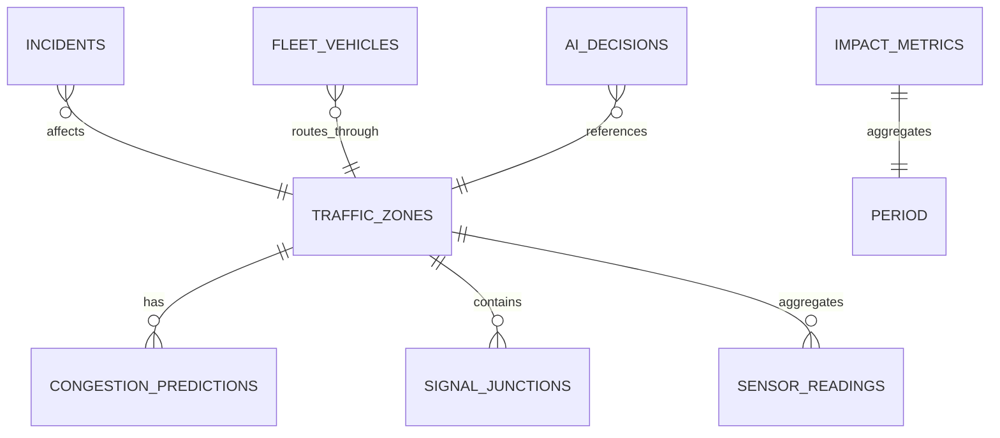

# Database Schema — Flipkart Gridlock 2.0

See `schema/init.sql` for full DDL.

## Entity Relationship



## Core Tables

### traffic_zones
Geohash-aggregated spatial units. Primary key is zone ID; geohash enables O(1) spatial lookup.

| Column | Type | Notes |
|--------|------|-------|
| geohash | VARCHAR(12) | qp-grid cell (precision 6 ≈ 1.2km) |
| ci | REAL | Congestion Index 0–1 |
| geom | GEOGRAPHY | PostGIS point for radius queries |

### congestion_predictions
Time-series forecasts from LSTM model. One row per zone per horizon per inference cycle.

| Column | Type | Notes |
|--------|------|-------|
| horizon_min | SMALLINT | 15, 30, or 60 |
| confidence | REAL | Model certainty 0–100 |
| risk_level | VARCHAR | Smooth → Severe Gridlock |

### incidents
Eight supported types: Accident, Breakdown, Closure, Flooding, Construction, Festival, Rally, Event.

### ai_decisions
Explainable AI audit trail. `reasons` stored as JSONB array of `{text, score, passed}`.

### fleet_vehicles
Flipkart delivery tracking with before/after AI ETA comparison.

### impact_metrics
Rollups for daily/weekly/monthly/yearly executive dashboards.

## Indexing Strategy

- `traffic_zones(geohash)` — primary spatial lookup
- `traffic_zones(ci DESC)` — critical zone queries
- `sensor_readings(geohash, recorded_at DESC)` — time-series aggregation
- `congestion_predictions(zone_id, created_at DESC)` — latest forecast per zone

## Sample Queries

```sql
-- Critical zones in next 60 minutes
SELECT z.name, p.predicted_ci, p.risk_level
FROM traffic_zones z
JOIN congestion_predictions p ON p.zone_id = z.id
WHERE p.horizon_min = 60 AND p.predicted_ci > 0.80
ORDER BY p.predicted_ci DESC;

-- Flipkart deliveries at risk
SELECT id, eta_min, ai_eta_min, route_ci
FROM fleet_vehicles
WHERE status = 'at-risk' AND optimized = false;
```
