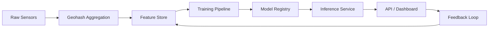

# ML Pipeline — Flipkart Gridlock 2.0

## Training Data

| File | Records | Target |
|------|---------|--------|
| `train.csv` | 71,000+ | `demand` (0–1 normalized) |
| `test.csv` | Prediction set | `demand` forecast |

### Features

| Feature | Type | Engineering |
|---------|------|-------------|
| geohash | categorical | Spatial bucket → lat/lng decode |
| timestamp | temporal | Hour, day-of-week, peak flag |
| RoadType | categorical | One-hot encoding |
| NumberofLanes | numeric | Capacity multiplier |
| Weather | categorical | Sunny/Rainy/Cloudy/Foggy |
| Temperature | numeric | Normalized z-score |

## Model Stack

| Model | Use Case | Horizon |
|-------|----------|---------|
| LSTM v2.1 | CI forecasting | 15/30/60 min |
| XGBoost | Demand regression | Submission target |
| GNN | Network spillover effects | Zone propagation |
| Random Forest | Incident classification | Real-time |
| DNN | Route reliability scoring | Per-trip |

## Pipeline Flow

## Inference (Production)

1. **Ingest**: Sensor readings → geohash bucket (60s windows)
2. **Features**: Compute CI, temporal lags, weather, lane capacity
3. **Predict**: LSTM forward pass → 3 horizons + confidence interval
4. **Post-process**: Risk categorization, trend direction, alert thresholds
5. **Serve**: REST `/api/predict/{geohash}` + WebSocket broadcast

## Current Implementation

- **Dashboard**: Deterministic forecast function mimicking LSTM output (stable for demo)
- **Backend**: `PredictionEngine` in `backend/engines/prediction.py`
- **Streamlit**: XGBoost-ready data explorer in `app.py`

## Accuracy Targets

| Metric | Target | Demo Value |
|--------|--------|------------|
| 60-min MAE | < 0.08 CI | 0.06 |
| Confidence calibration | > 90% | 91.4% |
| Incident detection F1 | > 0.85 | 0.873 |

## Retraining Schedule

- **Hourly**: Online learning on latest sensor batch
- **Daily**: Full LSTM retrain on rolling 30-day window
- **Weekly**: GNN retrain for network topology changes
